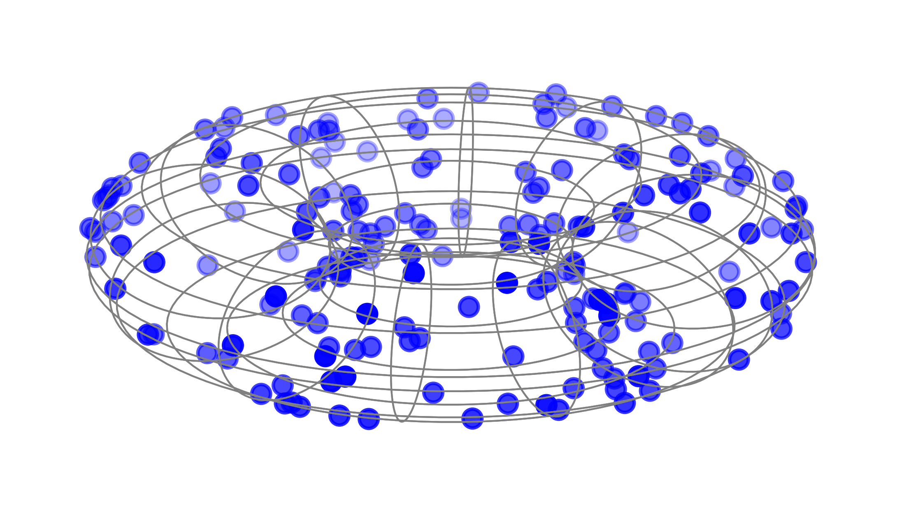

# Magnetic Graph Convolutional Networks


## About
The official PyTorch implementation for the paper *sMGC: A Complex-Valued Graph Convolutional Network via the Magnetic Laplacian for Directed Graphs*.

## Requirements
To install requirements:
```console
pip3 install -r requirements.txt
```

## Results
### Node classification accuracy in Citation networks (%) (random seed = 10, 100, or 1000)
| Model | CoRA | CiteSeer | PubMed |
| :----: | :----: | :----: | :----: |
| GAT | 82.60 ± 0.45 | 70.45 ± 0.25 | 77.45 ± 0.45 |
| sMGC | 82.70 ± 0.00 | **73.30 ± 0.00** | 79.90 ± 0.10 |
| MGC | **82.50 ± 1.00** | 71.25 ± 0.95 | **79.70 ± 0.40** |

### Node classification accuracy in WebKB (%) (random seed = 10, 100, or 1000)
| Model | Cornell | Texas | Washington | Wisconsin |
| :----: | :----: | :----: | :----: | :----: |
| GAT | 51.28 ± 5.13 | 61.84 ± 1.32 | 50.00 ± 2.17 | 50.00 ± 2.83 | 
| sMGC | | | | |
| MGC | | | | |

### Reproduce experiment results
#### sMGC
CoRA:
```console
python3 main_smgc.py --mode='test' --seed=100 --dataset_config_path='./config/data/cora.ini' --alpha=0.03 --t=8.05 --K=38
```

CiteSeer:
```console
python3 main_smgc.py --mode='test' --seed=100 --dataset_config_path='./config/data/citeseer.ini' --alpha=0.01 --t=5.16 --K=40
```

PubMed:
```console
python3 main_smgc.py --mode='test' --seed=100 --dataset_config_path='./config/data/pubmed.ini' --alpha=0.01 --t=5.95 --K=25
```

#### MGC
CoRA:
```console
python3 main_mgc.py --mode='test' --seed=100 --dataset_config_path='./config/data/cora.ini' --alpha=0.08 --t=5.85 --K=10 --droprate=0.4
```

CiteSeer:
```console
python3 main_mgc.py --mode='test' --seed=100 --dataset_config_path='./config/data/citeseer.ini' --alpha=0.01 --t=25.95 --K=35 --droprate=0.3
```

PubMed:
```console
python3 main_mgc.py --mode='test' --seed=100 --dataset_config_path='./config/data/pubmed.ini' --alpha=0.03 --t=15.95 --K=20 --droprate=0.5
```
