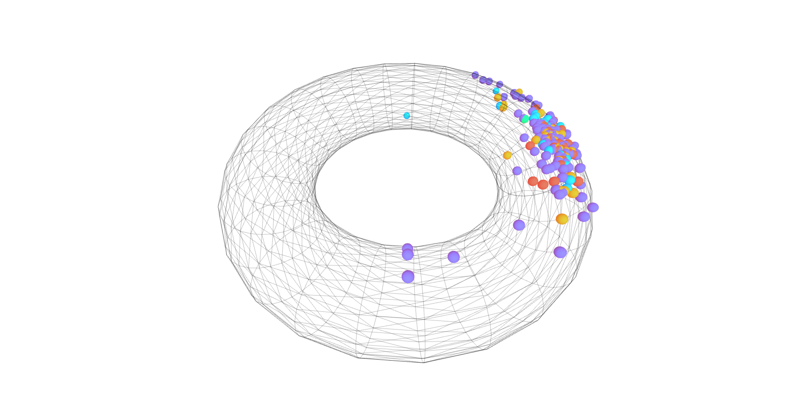
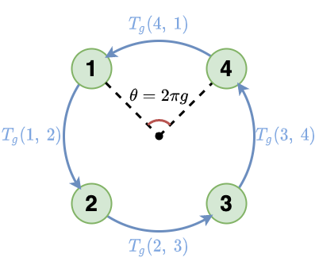

# Magnetic Graph Convolutional Networks v1



## About
The official PyTorch implementation for the paper *sMGC: A Complex-Valued Graph Convolutional Network via Magnetic Laplacian for Directed Graphs*.

## Requirements
To install requirements:
```console
pip3 install -r requirements.txt
```

## Results
### Node classification accuracy in Citation networks (%)
| Model | CoRA | CiteSeer | PubMed |
| :----: | :----: | :----: | :----: |
| GAT | 82.60 ± 0.40 | 70.45 ± 0.25 | 77.45 ± 0.45 |
| sMGC | **82.70 ± 0.00** | **73.30 ± 0.00** | **79.90 ± 0.10** |
| MGC | 82.50 ± 1.00 | 71.25 ± 0.95 | 79.70 ± 0.40 |

### Node classification accuracy in WebKB (%)
| Model | Cornell | Texas | Washington | Wisconsin |
| :----: | :----: | :----: | :----: | :----: |
| GAT | 41.03 ± 0.00 | 52.63 ± 2.63 | 63.04 ± 0.00 | 56.61 ± 1.88 |
| sMGC | 73.08 ± 1.28 | 71.05 ± 0.00 | 68.48 ± 3.26 | 80.19 ± 2.83 |
| MGC | **80.77 ± 3.85** | 82.90 ± 1.31 | 70.66 ± 1.08 | **87.74 ± 2.83** |

### Reproduce experiment results
#### sMGC
CoRA:
```console
python3 main_smgc.py --mode='test' --seed=100 --dataset_config_path='./config/data/cora.ini' --alpha=0.03 --t=8.05 --K=38
```

CiteSeer:
```console
python3 main_smgc.py --mode='test' --seed=100 --dataset_config_path='./config/data/citeseer.ini' --alpha=0.01 --t=5.16 --K=40
```

PubMed:
```console
python3 main_smgc.py --mode='test' --seed=100 --dataset_config_path='./config/data/pubmed.ini' --alpha=0.01 --t=5.95 --K=25
```

Cornell:
```console
python3 main_smgc.py --mode='test' --seed=100 --dataset_config_path='./config/data/cornell.ini' --alpha=0.95 --t=45.32 --K=12
```

Texas:
```console
python3 main_smgc.py --mode='test' --seed=100 --dataset_config_path='./config/data/texas.ini' --alpha=0.71 --t=45.08 --K=23
```

Washington:
```console
python3 main_smgc.py --mode='test' --seed=100 --dataset_config_path='./config/data/washington.ini' --alpha=0.77 --t=45.95 --K=44
```

Wisconsin:
```console
python3 main_smgc.py --mode='test' --seed=100 --dataset_config_path='./config/data/wisconsin.ini' --alpha=0.93 --t=25.76 --K=34
```

#### MGC
CoRA:
```console
python3 main_mgc.py --mode='test' --seed=100 --dataset_config_path='./config/data/cora.ini' --alpha=0.08 --t=5.85 --K=10 --droprate=0.4
```

CiteSeer:
```console
python3 main_mgc.py --mode='test' --seed=100 --dataset_config_path='./config/data/citeseer.ini' --alpha=0.01 --t=25.95 --K=35 --droprate=0.3
```

PubMed:
```console
python3 main_mgc.py --mode='test' --seed=100 --dataset_config_path='./config/data/pubmed.ini' --alpha=0.03 --t=15.95 --K=20 --droprate=0.5
```

Cornell:
```console
python3 main_mgc.py --mode='test' --seed=100 --dataset_config_path='./config/data/cornell.ini' --alpha=0.66 --t=38.49 --K=31 --droprate=0.6
```

Texas:
```console
python3 main_mgc.py --mode='test' --seed=100 --dataset_config_path='./config/data/texas.ini' --alpha=0.75 --t=0.53 --K=4 --droprate=0.5
```

Washington:
```console
python3 main_mgc.py --mode='test' --seed=100 --dataset_config_path='./config/data/washington.ini' --alpha=0.73 --t=42.36 --K=21 --droprate=0.1
```

Wisconsin:
```console
python3 main_mgc.py --mode='test' --seed=100 --dataset_config_path='./config/data/wisconsin.ini' --alpha=0.34 --t=0.52 --K=12 --droprate=0.5
```
